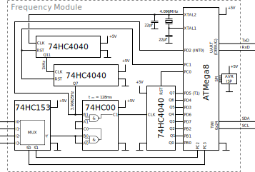

# AVR-based Frequency Counter

The AVR-based frequency counter is partly based on the project developed by [Herbert Dingfelder](http://www.herbert-dingfelder.de/?page_id=304) with some extensions and modifications.
It contains a ATmega8 responsible for measuring the frequency of a square-wave applied to one of four input channels (selectable) and acting as a TWI slave (I2C).
With the current design, frequencies of up to 50 MHz are measurable with a precision of 10 Hz.

The AVR-based frequency counter was developed and used as part of the [Embedded Testbench (ETB)](https://github.com/DoWiD-wsn/embedded_testbench) where it was used to measure the frequency stability of the internal clock of microcontroller units of embedded systems under different conditions such as ambient temperature and supply voltage level.


For more information on the PCB (and its design) refer to [docs/pcb_design.md](docs/pcb_design.md).


## Directory structure

```
.
├── docs                : documents
│   ├── datasheets      : datasheets of used components
│   └── pcb_design.md   : information on the PCB design
├── kicad               : KiCad files
├── media               : Miscellaneous media (images, etc.)
│   ├── evaluation      : Image of a first prototype evaluation
│   ├── i2c             : I2C register format
│   ├── pcb             : Photos and rendered images of the PCB
│   └── schematic       : SVG images of the schematics
└── source              : C code sources for the ATmega8
```


## Contents

* [Description](#description)
* [Built with](#built-with)
* [Preparation](#preparation)
* [I2C Interface](#i2c-interface)
* [Evaluation](#evaluation)
* [Contributors](#contributors)
* [Changelog](#changelog)
* [License](#license)


## Description

**Schematic** (draft):  


The ATmega8 is clocked with an external quartz crystal with a frequency of 4.096 MHz.
This clock signal is also used to generate a gate-enable signal for the actual frequency counting stage.
To do so, the 4.096 MHz are first divided by a 74HC4040 with a factor of 2^12 (4096) to get a 1 kHz signal that is further divided by a second 74HC4040 with a factor of 2^8 (256) to have an enable signal with a frequency of 3.90625 Hz (corresponds to an enable time of 128 ms (high level)).

The 74HC153 is used to select between four different input channels.
During the 128 ms long high period of the second 74HC4040, the signal of at the selected input channel is forwarded to the third 74HC4040.
That third 74HC4040 forms together with the ATmega8 the actual counting part, that is, both components together form a 24-bit counter that counts the number of periods of the selected input signal during the 128 ms long enable period.
Thereby, the lower 8-bit (fast portion) are counted by the 74HC4040 and, since the eight bit (Q7) triggers the ATmega8' internal 16-bit counter module, the higher 16-bit are counted internally by the ATmega8.
As the 128 ms enable signal is also connected to the external interrupt (INT0) of the ATmega8, the ATmega8 is "informed" whenever a counting period has finished and can then calculate the corresponding frequency of the input signal.
To do so, the 24-bit counter (lower 8-bit read via GPIOs and the higher 16-bit available interally) show how many periods have passed in the last 128 ms and, thus, allow to easily calculate the resulting frequency.

The measured frequency is output via the UART debug interface (default: 8N1 @9600baud).
As the ATmega8 is configured as an I2C slave (address to be defined in software; default: `0x24`), the result can also be obtained via I2C.
Additionally, the I2C interface can be used to configure the basic operation of the frequency counter such as:

* result resolution (Hz, kHz, or MHz)
* input channel (CH0, CH1, CH2, or CH3)
* sampling rate (no sampling, 3 samples, 5 samples, or 10 samples)

Additionally, the result ready flag can be read indicating whether a result is already available.
In case required, also a counter reset (clearing of all registers) can be requested via I2C.


## Built with

The entire code only depends on the basic AVR libraries (i.e., AVR libc) and can be easily compiled with the AVR GCC.
To upload the binary to the ATmega8, the [AVR-ISP](https://www.mikrocontroller.net/articles/AVR_In_System_Programmer) can be used in combination with [AVRdude](https://www.nongnu.org/avrdude/) or similar.

* [avr-gcc 5.4.0](https://gcc.gnu.org/wiki/avr-gcc) - C code library
* [avr-libc 2.0.0](https://www.nongnu.org/avr-libc/) - C code library


## Preparation

Aside from the hardware circuit, it is important to properly set the fuses of the used ATmega8.
The fuses take care of a basic configuration of the ATmega8, or more precisely, they define the clock source and some interfacing options.
For the AVR-based frequency counter, we choose to have an external crystal oscillator and at startup we will give it some clock cycles to become stable.
As stated in the [ATmega8 datasheet](https://www.microchip.com/wwwproducts/en/ATmega8), we need to have the clock selection fuses `CKSEL` set to `1111` and the start-up times fuses `SUT` set to `11`, resulting in the `low fuse byte` to be set to `0xFF` (Note: the fuse bits are active low, i.e. programmed=0, unprogrammed=1; see also [AVR Fuse Calculator](http://eleccelerator.com/fusecalc/fusecalc.php?chip=atmega8)).

In the `high fuse byte`, we leave the boot size selection bits enabled, i.e., `BOOTSZ` is `00`, and we keep the serial programming and data downloading `SPIEN` enabled (otherwise we would not be able to use the [AVR ISP](https://www.mikrocontroller.net/articles/AVR_In_System_Programmer) to flash our firmware).
Additionally, we need to program the oscillator options fuse `CKOPT` to `0` to switch the crystal from weak amplitude to full amplitude required to clock the [74HC4040](https://www.ti.com/product/SN74HC4040) counter.
As a result, we need to set the `high fuse byte` to `0xC9`.

The fuse bit values and the resulting bit pattern as well as the corresponding [AVRDUDE](https://www.nongnu.org/avrdude/) commands can be derived with one of the available [online fuse calculator](https://www.engbedded.com/fusecalc/).
In our case, the resulting AVRDUDE arguments are:  
  `-U lfuse:w:0xff:m -U hfuse:w:0xc9:m`


## I2C Interface

The AVR-based frequency counter can be used as an I2C slave.
The I2C address can be defined in software (default: 0x24).

Basically, there are four 8-bit registers available and accessible via I2C, that are:

1. Configuration register `CONFIG` (address: `0x00`; R/W)
2. Frequency LSB register `FREQ-LSB` (address: `0x01`; R)
3. Frequency MSB register `FREQ-MSB` (address: `0x02`; R)
4. Frequency extended MSB register `FREQ-XMSB` (address: `0x03`; R)

As can be seen, all registers can be read but only the `CONFIG` register allows overwriting its value; the measured frequency value can only be read.

With the `CONFIG` register, the basic operation of the frequency counter can be defined, that is, requesting a software reset, checking the result ready flag, setting the sampling rate, defining the frequency resolution, and selecting the input channel (see figure below).
The default value of the `CONFIG` register is `0x00`.


### Reset request

The reset request bit can be used to cause a software reset of the frequency counter, that is, all counter modules and internal counter values are reset.
The configuration is not changed.

| `RST` | Effect        |
|-------|---------------|
| `0`   | no effect     |
| `1`   | request reset |


### Result ready

The result ready flag indicates whether a frequency measurement is ready to be read.

| `RDY` | Meaning              |
|-------|----------------------|
| `0`   | result not available |
| `1`   | result available     |


### Result sampling

The frequency counter offers to possibility to sample several measurements and provide the mean average to have more stable results.
Thereby, one of four different sampling options can be selected.

| `SMP1` | `SMP0` | Sampling             |
|--------|--------|----------------------|
| `0`    | `0`    | no sampling          |
| `0`    | `1`    | 3 samples            |
| `1`    | `0`    | 5 samples            |
| `1`    | `1`    | 10 samples           |


### Result resolution

The resulting frequency can be read in three different resolution.

| `RES1` | `RES0` | Resolution (result width) |
|--------|--------|---------------------------|
| `0`    | `0`    | Hz (24 bit: LSB+MSB+XMSB) |
| `0`    | `1`    | kHz (16 bit: LSB+MSB)     |
| `1`    | `0`    | MHz (8 bit: LSB)          |
| `1`    | `1`    | reserved                  |


### Input channel selection

With the `CHSEL` bits, the input channel can be selected, that is, the channel that is latched through by the 4-to-1 multiplexer.

| `CHSEL1` | `CHSEL0` | Channel |
|----------|----------|---------|
| `0`      | `0`      | CH0     |
| `0`      | `1`      | CH1     |
| `1`      | `0`      | CH2     |
| `1`      | `1`      | CH3     |


## Evaluation

The concept was evaluated based on a prototype as shown below.
In this prototype, the multiplexer was neglected and the input signal was connected to the counting stage via a jumper.


To check the proper functioning of the prototype, a second microcontroller was used that output its internal clock source via a GPIO pin (the AVR offer to output the clock source to a GPIO named `CLKO`).
In this test setup, the clock source of the microcontroller under test was changed every few seconds between four different clock options:

1. internal 8MHz RC oscillator (Fcpu = 8MHz)
2. internal 8MHz RC oscillator with a prescaler of 8 (Fcpu = 1MHz)
3. external 16MHz quartz oscillator (Fcpu = 16MHz)
4. external 16MHz quartz oscillator with a prescaler of 8 (Fcpu = 2MHz)


These measurements were confirmed with an oscilloscope that also measured the frequency.
Thereby, the expected accuracy of 10Hz could be confirmed.


## Contributors

* **Dominik Widhalm** - [***DC-RES***](https://informatics.tuwien.ac.at/doctoral/resilient-embedded-systems/) - [*UAS Technikum Wien*](https://embsys.technikum-wien.at/staff/widhalm/)

Contributions of any kind to improve the project are highly welcome.
For coding bugs or minor improvements simply use pull requests.
However, for major changes or general discussions please contact [Dominik Widhalm](mailto:widhalm@technikum-wien.at?subject=frequency%20counter%20on%20GitHub).


## Changelog

A list of prior versions and changes between the updates can be found inn the [CHANGELOG.md](CHANGELOG.md) file.
Note that the major and minor number refer to the hardware version of the ASN(x) board while the patch version is used to denote subsequent software versions.


## License

This project is licensed under the MIT License - see the [LICENSE.md](LICENSE.md) file for details.
