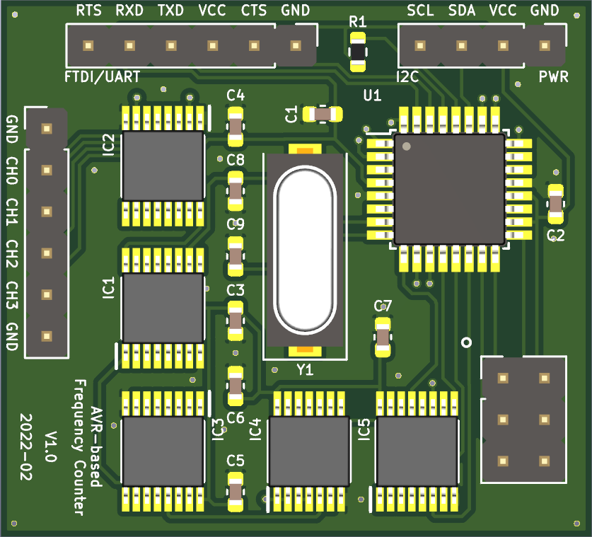

# ASN(x) - PCB Design

The board was designed with KiCad `version 5.1.9` and mainly uses schematic symbols and PCB footprints available in the [KiCad libraries](https://kicad.org/libraries/download/).
Parts not included in these libraries are available as project-specific libraries (see below).
The design requires only a two-layer PCB with all components placed on the top side.


## Contents

```
kicad/
├── 3dshapes                        : 3D models of PCB parts
├── myfootprint.pretty              : custom PCB footprints
├── bom                             : interactive HTML BOM
├── frequency_counter.kicad_pcb     : PCB layout file
├── frequency_counter.pro           : KiCad project file
├── frequency_counter.sch           : schematic layout file
├── fp-lib-table                    : project-specific footprint library list
├── mysymbols.dcm                   : custom symbol library (descriptions, aliases and keywords)
├── mysymbols.lib                   : custom symbol library
└── sym-lib-table                   : project-specific symbol library list
```

## Schematic

**Schematic**:  


## PCB Design

Front:  


Back:  


For the PCB design the following rules were used:
* Design rules:
    * Minimum track width: `0.15 mm`
    * Minimum via diameter: `0.6 mm`
    * Minimum via drill: `0.3 mm`
    * Minimum hole to hole: `0.25 mm`
    * `Prohibit overlapping courtyards`
* Tracks:
    * `0.2 mm`
    * `0.25 mm`
    * `0.4 mm`
    * `0.8 mm`
* Vias:
    * Size: `0.6 mm`
    * Drill: `0.3 mm`
* Zones:
    * Clearance: `0.3 mm`
    * Minimum width: `0.18 mm`
    * Pad connections: `Thermal reliefs`
    * Thermal clearance: `0.18 mm`
    * Thermal spoke width: `0.8 mm`


## Components and Libraries

An interactive BOM can be found in the `/kicad/bom/` directory (see [here](../kicad/bom/frequency_counter.html); created with [InteractiveHtmlBom](https://github.com/openscopeproject/InteractiveHtmlBom)).

| Reference | Value | Symbol Library | Symbol | Footprint Library | Footprint | Dist. |
|-----------|-------|----------------|--------|-------------------|-----------|---------|
| C8-C9     | 18pF  | Device         | C      | Capacitor_SMD     | C_0603_1608Metric | [Farnell](https://at.farnell.com/kemet/c0603c180k5ractu/kondensator-18pf-50v-10-x7r-0603/dp/2821151) |
| C1-C7     | 100nF | Device | C      | Capacitor_SMD     | C_0603_1608Metric | [Farnell](https://at.farnell.com/kemet/c0603c104m5ractu/kondensator-0-1-f-50v-20-x7r-0603/dp/2581046) |
| R1        | 4k7   | Device        | R      | Resistor_SMD      | R_0603_1608Metric | [Farnell](https://at.farnell.com/yageo/ac0603fr-074k7l/dickschichtwiderstand-4k7-1-0/dp/3495274) |
| U1        | -     | MCU_Microchip_ATmega | ATmega8-16AU | Package_QFP | TQFP-32_7x7mm_P0.8mm | [Farnell](https://at.farnell.com/microchip/atmega8-16au/8bit-8k-flash-mcu-smd-tqfp32/dp/9171371) |
| IC1,IC3,IC5 | -   | *mysymbols*`*` | SN74HC4040PW | *myfootprint*`*` | SOP65P640X120-16N | [Farnell](https://at.farnell.com/texas-instruments/sn74hc4040pw/logic-counter-async-binary-16tssop/dp/3119823) |
| IC2       | -     | *mysymbols*`*` | SN74HC153PW  | *myfootprint*`*` | SOP65P640X120-16N | [Farnell](https://at.farnell.com/texas-instruments/sn74hc153pw/logic-selector-mux-dual-4-1-16tssop/dp/3121093) |
| IC4       | -     | *mysymbols*`*` | SN74HC00PW   | *myfootprint*`*` | SOP65P640X120-14N | [Farnell](https://at.farnell.com/texas-instruments/sn74hc00pwr/ic-quad-2input-nand-smd-74hc00/dp/3120421) |
| Y1        | 4.096MHz  | Device     | Crystal      | Crystal          | Crystal_SMD_HC49-SD | [Farnell](https://at.farnell.com/vishay/xt9m20ana4m096/quarz-4-096mhz-at-modus-hc49-4hsmx/dp/1611766) |
| J1        | -     | Connector_Generic | Conn_01x04 | Connector_PinHeader_2.54mm | PinHeader_1x04_P2.54mm_Vertical | [Farnell](https://at.farnell.com/wurth-elektronik/61304011121/stiftleiste-2-54mm-tht-vertikal/dp/2356175) |
| J2-J3     | - | Connector_Generic | Conn_01x06 | Connector_PinHeader_2.54mm | PinHeader_1x06_P2.54mm_Vertical | [Farnell](https://at.farnell.com/wurth-elektronik/61304011121/stiftleiste-2-54mm-tht-vertikal/dp/2356175) |
| J4        | - | Connector | AVR-ISP-6 | Connector_PinHeader_2.54mm | PinHeader_2x03_P2.54mm_Vertical | [Farnell](https://at.farnell.com/wurth-elektronik/61304021121/stiftleiste-2-54mm-tht-vertikal/dp/2356148) |

If your installation of KiCad is missing (some of) the standard libraries, you can download them from [KiCad libraries](https://kicad.org/libraries/download/).
The custom libraries required (marked with `*`) are all contained in this repository.
